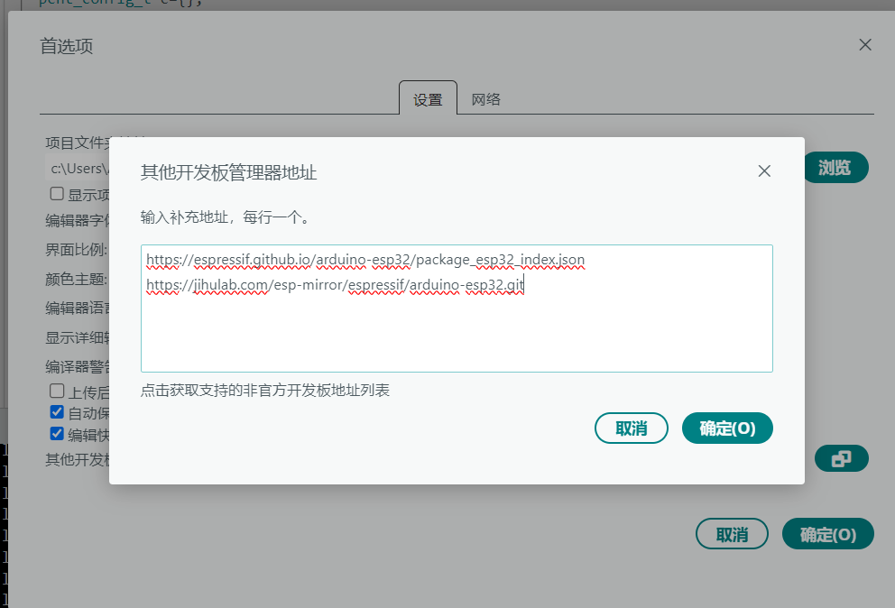
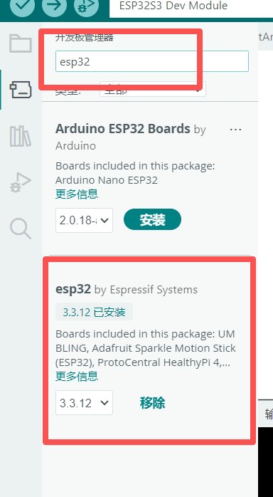
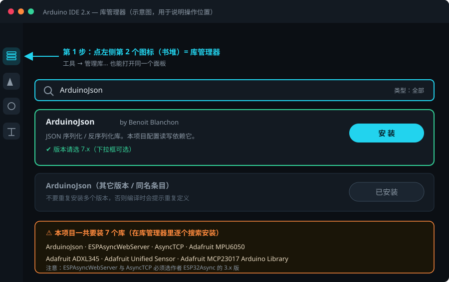
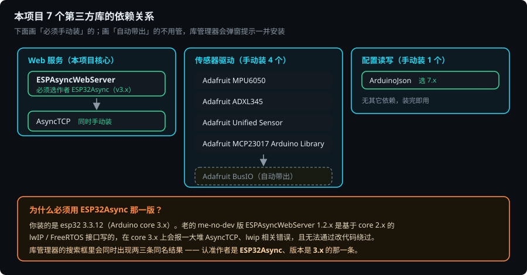
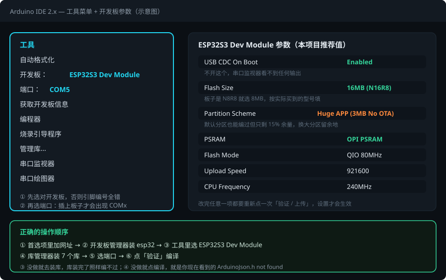

# 新手文档 · Arduino 环境搭建（ESP32-S3 格斗车）

> 这份文档是给**第一次用 Arduino IDE 玩 ESP32** 的人写的。
> 目标只有一个：从「装完 IDE 什么板子都没有」走到「本项目一次编译通过」。
>
> 全程按顺序做即可。**顺序很重要**：先让开发板出现 → 再选对板子和端口 → 最后装库。
> 顺序错了会出现「库都装完了还是编不过」的假象，那是你在给一个不存在的开发板装库。

---

## 0. 三句话讲清你遇到的三件事

| 你看到的现象 | 真实原因 | 去哪一节 |
|---|---|---|
| 工具 → 开发板 里只有 Arduino Uno / Nano，没有 ESP32 | Arduino IDE 出厂只带 Arduino 自家板子，**需要手动添加第三方开发板索引地址** | [第 1 节](#1-让-esp32-开发板出现) |
| 开发板管理器里搜不到 / 下载卡住 / 下到一半失败 | 索引地址没加，或加了但走的是国外源，被墙/超时 | [第 1 节](#1-让-esp32-开发板出现) |
| 编译时报 `fatal error: ArduinoJson.h: No such file or directory` | 这是**库**没装，跟开发板是两码事 | [第 2 节](#2-编译报-xxxh-no-such-file-怎么修) |

> ⚠️ 还有一个前提：你机器上已经装的是 **esp32 3.3.12**，也就是 Arduino core **3.x**。
> 这一条会直接影响「要装哪一版的 ESPAsyncWebServer」，务必看 [2.4 节](#24-最容易踩的坑core-3x-必须用-esp32async-版的-async-web-库)。

---

## 1. 让 ESP32 开发板出现

### 1.1 现象

打开 Arduino IDE → 菜单 `工具` → `开发板`，列表里只有 `Arduino AVR Boards`（Uno、Nano、Mega…），
下拉到最底下也找不到任何带 `ESP32` 字样的分类。这就是"提示没有开发板"。

### 1.2 操作：添加开发板管理器地址

菜单路径：**文件 → 首选项**（快捷键 `Ctrl + 逗号`），在弹出的窗口找到最下面一行
**「附加开发板管理器地址」**（英文界面叫 *Additional boards manager URLs*），点右侧的小图标展开成多行输入框。



> 图里输入框显示**红色波浪线是正常现象**——那是 IDE 的文本校验提示，不代表地址写错。
> 点「确定」后 IDE 会自己去拉取索引，能不能用要看开发板管理器里有没有搜出结果。

把下面这一行粘进去（**一行一个地址，不要用逗号**）：

```
https://espressif.github.io/arduino-esp32/package_esp32_index.json
```

如果下载慢 / 拉不到，就再加一行国内镜像（**任选其一，多填会按顺序试**）：

| 用途 | 地址 | 备注 |
|---|---|---|
| 官方（国外源） | `https://espressif.github.io/arduino-esp32/package_esp32_index.json` | 你截图里第一条，正确 |
| 官方备用（国外源） | `https://dl.espressif.com/dl/package_esp32_index.json` | 老教程里最常见的地址 |
| 清华 TUNA 镜像 | `https://mirrors.tuna.tsinghua.edu.cn/esp/arduino/package_esp32_index.json` | 国内速度稳 |
| 极狐 JihuLab 镜像 | `https://jihulab.com/esp-mirror/espressif/arduino-esp32/-/raw/gh-pages/package_esp32_index_cn.json` | 国内速度稳 |

> ❗ **你截图里第二条 `https://jihulab.com/esp-mirror/espressif/arduino-esp32.git` 请删掉。**
> 那是一个 **git 仓库克隆地址**，不是开发板索引文件。开发板管理器只认 `.json` 结尾的索引地址，
> 填 `.git` 地址它解析不了，会静默失败——这很可能就是你"下载不了"的直接原因。
> 想用极狐源，请换成上表最后一行那个结尾是 `package_esp32_index_cn.json` 的地址。

点「确定」保存。**不需要重启 IDE。**

### 1.3 安装 esp32 平台包

菜单：**工具 → 开发板 → 开发板管理器**，在搜索框输入 `esp32`。



搜索结果里会出现**两个不同的东西**，必须认准：

| 条目 | 作者 | 是你要的吗？ |
|---|---|---|
| **esp32** | **Espressif Systems** | ✅ **就是这个**，你的截图里显示已装 3.3.12 |
| Arduino ESP32 Boards | Arduino | ❌ 别装。这个只支持 Arduino 官方的 Nano ESP32，跟你的板子无关 |

找到 `esp32 by Espressif Systems` → 版本下拉框选 **3.3.x**（最新稳定版）→ 点「安装」。

安装包体积约 250MB～1GB（含编译器工具链），视网速要几分钟到几十分钟，
**期间不要关 IDE、不要断网**。装完按钮会变成「移除」，说明成功了。

> 如果之前装过一半失败了，先点一次「移除」再重新安装，避免残留半套文件。

### 1.4 下载总是失败怎么办

按顺序试：

1. **换镜像**：把第 1.2 节表格里的国内镜像地址加进去，重启一次 IDE。
2. **删掉坏缓存**后重装：
   ```
   %LOCALAPPDATA%\Arduino15\packages\esp32
   ```
   把这个 `esp32` 文件夹整个删掉，再回开发板管理器重新安装。
3. **挂代理**：Arduino IDE 2.x 会读取系统代理设置，先在系统里配好再重开 IDE。
4. **换时间段**：国外源在白天/晚高峰经常断，凌晨重试成功率明显更高。
5. **实在不行用离线包**：下载 `esp32-3.3.12.zip` 后放进
   `%USERPROFILE%\Documents\Arduino\hardware\esp32\3.3.12\`（需自己建目录），
   再从 Git 拉 `esp32-arduino-libs`、`xtensa-esp32s3-elf` 工具链放同级目录。此路较绕，建议优先用镜像。

---

## 2. 编译报 `xxx.h: No such file` 怎么修

### 2.1 先读懂这个报错

你遇到的完整报错是这样的（只保留关键几行）：

```
In file included from ...\Example\Example.ino:19:
...\Example\config.h:18:10: fatal error: ArduinoJson.h: No such file or directory
   18 | #include <ArduinoJson.h>
      |          ^~~~~~~~~~~~~~~
Alternatives for ArduinoJson.h: []
ResolveLibrary(ArduinoJson.h)
-> candidates: []
Compilation error: ArduinoJson.h: No such file or directory
```

逐句翻译：

- `fatal error: ArduinoJson.h: No such file or directory`
  → 编译器在**所有库目录**里都没找到这个头文件。
  注意：这不代表你的代码写错了，而是**机器上根本没装这个库**。
- `Alternatives for ArduinoJson.h: []`
  → IDE 帮你找了一遍替代品，结果是空列表，进一步确认"库不存在"。
- `-x c++ -E -CC ... .libsdetect.d`
  → 这是 IDE 在正式编译前的"**扫库**"步骤：先预处理一遍，看看你 `#include` 了哪些库。
  **扫库阶段就会失败并停下**，所以你只会看到第一个缺失的库。
  这意味着：**装完 ArduinoJson 再编译，会接着报第二个、第三个……** 这是正常的，
  因为本项目一共要用 7 个第三方库。

所以正确做法不是"报一个装一个"，而是**一次性把 7 个都装齐**。

### 2.2 操作：打开库管理器

菜单路径二选一：

- **工具 → 管理库…**
- 或点 IDE 最左侧竖排图标里的**第 2 个图标**（叠起来的书堆）

搜索框输入库名 → 找到对应条目 → 点「安装」。



> 上图是示意图，用来告诉你"搜索框在哪、安装按钮在哪"。
> 实际操作界面和你截图里的开发板管理器长得几乎一样，只是标题变成「库管理器」。

### 2.3 本项目要装的 7 个库（照着抄）

在库管理器的搜索框里**逐个搜索**下面这些名字，安装按钮点一下即可。

> ⚠️ **注意搜索结果里的显示名和"通用叫法"不完全一样**，认准作者栏即可。
> 下表右边两列是**你这台机器上已经装好、且实测能编过的版本**，照着对齐最省事。

| # | 搜索框里输入 | 列表里显示的条目名 | 作者 | 实测可用版本 | 用来做什么 |
|---|---|---|---|---|---|
| 1 | `ArduinoJson` | ArduinoJson | Benoit Blanchon | **7.3.1** | 配置读写、WebSocket 报文 |
| 2 | `ESPAsyncWebServer` | **ESP Async WebServer**（名字中间有空格） | **ESP32Async** | **3.6.0** | 网页服务器 + WebSocket |
| 3 | `AsyncTCP` | **Async TCP**（名字中间有空格） | **ESP32Async** | **3.3.2** | 上面那个库的底层 TCP |
| 4 | `Adafruit MPU6050` | Adafruit MPU6050 | Adafruit | **2.2.9** | 陀螺仪（偏航角） |
| 5 | `Adafruit ADXL345` | Adafruit ADXL345 | Adafruit | **1.3.4** | 加速度计（倾角/撞击） |
| 6 | `Adafruit Unified Sensor` | Adafruit Unified Sensor | Adafruit | **1.1.15** | 上面两个驱动的前置依赖 |
| 7 | `Adafruit MCP23017 Arduino Library` | Adafruit MCP23017 Arduino Library | Adafruit | **2.3.2** | 16 位 IO 扩展（灰度 + 光电） |

另外会自动被带出来的（库管理器会弹窗问你要不要一起装，**点「安装全部」**）：

- `Adafruit BusIO`（你这台机器上已装 1.17.4）—— 第 4～7 号库共用的底层 I2C/SPI 助手。

> 列表里可能还会看到 `ESPAsyncTCP`（这是 ESP8266 用的，**ESP32 项目用不到，装了也不影响**）、
> `Adafruit GFX Library` / `Adafruit SSD1306`（别的项目留下的，同样不影响编译）。不用特意去删。

装完可以在 `工具 → 管理库…` 里切到「已安装」标签核对，也可以直接去磁盘上看：

```
%USERPROFILE%\Documents\Arduino\libraries\
```

里面应该能看到 `ArduinoJson`、`ESPAsyncWebServer`、`AsyncTCP`、`Adafruit_MPU6050` 等文件夹。

> ✅ **本项目的已验证组合**（在这台机器上真机编译通过）：
> `esp32:esp32 3.3.12` + `ArduinoJson 7.3.1` + `ESP Async WebServer 3.6.0` + `Async TCP 3.3.2`
> + `Adafruit MPU6050 2.2.9 / ADXL345 1.3.4 / Unified Sensor 1.1.15 / MCP23017 2.3.2`
> → 编译结果：**Flash 占用 1,117,244 字节（85%），全局变量 51,648 字节（15%）**，零错误。

### 2.4 最容易踩的坑：core 3.x 必须用 ESP32Async 版的 async web 库



你截图里装的是 **esp32 3.3.12**，也就是 **Arduino core 3.x**。
这里有一个新手几乎 100% 会踩的坑：

- **老版本 `ESPAsyncWebServer 1.2.x`（作者 Hristo Gochkov / me-no-dev）在 core 3.x 上编不过。**
  它底层调的是 core 2.x 的 lwIP / FreeRTOS 接口，core 3.x 已把这些接口改掉了，
  会报一大串 `AsyncTCP` / `lwip` / `pxCurrentTCB` 相关的错误，而且**改业务代码也没用**。
- **正确选择**：库管理器里有几条相近的结果，认准作者是 **ESP32Async**、版本是 **3.x** 的那条
  （列表里显示为 **ESP Async WebServer**），`Async TCP` 同样选 **ESP32Async** 版（显示为 **Async TCP**）。
  这两个库是配套发布的，必须成对安装。

> 你这台机器上**已经装的就是这一对**：`ESP Async WebServer 3.6.0` + `Async TCP 3.3.2`。
> 也就是说这个坑你已经绕过去了，不用再动。

> 顺带说明：本项目源码**已经内置了双版本兼容**——`motor.cpp` 里的 LEDC 宏会自动适配
> core 2.x（按通道）和 core 3.x（按引脚）；`web.cpp` 里的整页下发也按
> `ASYNCWEBSERVER_FORK_ESP32Async` 宏自动切换 API。
> 所以你**不需要**为此修改任何代码，选对库就行。

### 2.5 库装完了怎么还报同样的错

按这个顺序排查：

1. **重启 IDE。** 库列表是启动时扫描的，装完不重启有时仍然找不到。彻底一点：
   关掉 IDE → 删除 `%LOCALAPPDATA%\arduino\sketches\` 下的缓存目录 → 重新打开。
2. **确认没装成"重复版本"。** 同一个库装了两份（比如 `ArduinoJson` 和 `ArduinoJson-main`）
   会报 `multiple definition` 之类的错误。去 `Documents\Arduino\libraries\` 里删掉多余的，
   只保留一份。
3. **确认装的是 ESP32 版而不是 ESP8266 版。** 有的库同时有 8266/32 两个包，装错了会报
   `lib not compatible with current architecture`。
4. **确认开发板已经选对**（见第 3 节）。板子选错时 IDE 会按错误的架构去扫库。

---

## 3. 选开发板、选端口、配参数

### 3.1 选开发板

菜单：**工具 → 开发板 → esp32 → ESP32S3 Dev Module**。

装好 esp32 包之后，`开发板` 菜单里会多出一个 `esp32` 分组，进去选 **ESP32S3 Dev Module**
（你的板子是 ESP32-S3 DevKitC-1 N16R8，对应的就是这一项）。

### 3.2 配参数（照抄下表）



| 参数 | 建议值 | 为什么 |
|---|---|---|
| **USB CDC On Boot** | **Enabled** | ⚠️ 不开这个，串口监视器里**一个字都看不到**（你日志里是 `ARDUINO_USB_CDC_ON_BOOT=0`，建议改掉） |
| Flash Size | 16MB（N16R8）；N8R8 选 8MB | 别填错，填大了会烧录失败 |
| **Partition Scheme** | `16M Flash (3MB APP/9.9MB FATFS)`，或 `Huge APP (3MB No OTA/1MB SPIFFS)` | **默认分区实测也能编过**（占用 85%），但只剩约 190KB 余量；换大分区是为了留后续加功能的余地，顺便避免"再加几行就爆" |
| PSRAM | OPI PSRAM | N16R8 是 OPI PSRAM |
| Flash Mode | QIO 80MHz | 与 N16R8 匹配 |
| Upload Speed | 921600 | 快且稳；不稳就降到 460800 |
| CPU Frequency | 240MHz | 控制任务节拍依赖 |
| Core Debug Level | 无 | 调试时可改「错误」 |

改完任意一项，都要**重新点一次编译/上传**才生效。

### 3.3 选端口

菜单：**工具 → 端口**，选 `COMx`。插上板子才会有这个选项。

端口列表是空的 / 上传报 `port not found`，按顺序查：

1. **换一根数据线。** 很多线是"只充电不传数据"的，这是最高频的坑。
2. **装 USB 转串口驱动。** DevKitC-1 有的批次用 CH340，有的用 CP2102：
   - CH340：`http://www.wch.cn/download/CH341SER_EXE.html`
   - CP210x：Silicon Labs 官网 CP210x VCP Driver
3. **按住 BOOT 再点上传。** 有些板子自动进入下载模式失败，需要：按住 `BOOT` → 点上传 →
   看到"正在连接"再松开。
4. **换 USB 口**（优先插主机后面的 USB 口，别用前面板或扩展坞）。

---

## 4. 常见报错速查表

| 报错关键字 | 含义 | 处理 |
|---|---|---|
| `fatal error: XXX.h: No such file or directory` | 缺少第三方库 | 第 2 节，去库管理器装对应库 |
| `Alternatives for XXX.h: []` | 同上，IDE 没找到任何替代 | 同上 |
| `Compilation error: XXX.h: No such file or directory` | 同上（IDE 2.x 的汇总行） | 同上 |
| `text section exceeds available space in board` | 分区余量不够（本项目在默认分区下已占 85%，再加几行就可能顶到上限） | 分区方案改 `16M Flash (3MB APP/9.9MB FATFS)` 或 `Huge APP (3MB No OTA)` |
| `Sketch too big` | 同上 | 同上 |
| `error: 'ledcSetup' was not declared` | 用了老版 ESP32 core 的写法编到 core 3.x | 本项目已用宏兼容；若你改过 `motor.cpp`，请还原 |
| `pxCurrentTCB` / `lwip_*` / `AsyncTCP` 报错 | 装了 me-no-dev 老版 async web 库 | 换成 **ESPAsyncWebServer + AsyncTCP by ESP32Async (3.x)** |
| `multiple definition of XXX` | 同一个库装了两份 | 去 `Documents\Arduino\libraries\` 删掉多余的 |
| `esp32.h: No such file` / 找不到 `WiFi.h` | 开发板没选对，或 esp32 包没装好 | 第 1、3 节 |
| `Failed to connect to ESP32-S3: No serial data received` | 没进下载模式 | 按住 BOOT 再上传；换线换口 |
| `Compilation error: exec: ... xtensa-esp32s3-elf-g++: not found` | esp32 包安装不完整 | 删掉 `Arduino15\packages\esp32` 重装（第 1.4 节） |
| 串口监视器一片空白 | USB CDC 没开 / 波特率不对 | 开发板参数 `USB CDC On Boot = Enabled`，波特率 115200 |
| `项目文件夹必须与文件名同名` | Arduino 强制要求 `.ino` 名 = 文件夹名 | 见下条 |

> 关于文件夹命名：Arduino 要求**主 `.ino` 文件与它所在文件夹同名**。
> 本工程主文件是 `CombatBot_Fusion.ino`。Arduino IDE 要求它所在目录也叫 `CombatBot_Fusion`；如果下载后的仓库目录名不同，请先重命名目录再打开。

---

## 5. 一次性成功的完整清单

照着打勾，打完全部再点编译：

- [ ] 文件 → 首选项 → 附加开发板管理器地址，填了 `https://espressif.github.io/arduino-esp32/package_esp32_index.json`（`.git` 那条已删除）
- [ ] 工具 → 开发板 → 开发板管理器，搜索 `esp32`，安装了 **esp32 by Espressif Systems 3.3.x**
- [ ] 工具 → 开发板 → esp32 → 选中 **ESP32S3 Dev Module**
- [ ] 工具 → 开发板 → 参数已按 3.2 节表格设置（重点：USB CDC On Boot = Enabled、分区 = Huge APP）
- [ ] 工具 → 管理库，装齐 7 个库：ArduinoJson(7.x)、ESPAsyncWebServer(**ESP32Async 3.x**)、AsyncTCP(**ESP32Async 3.x**)、Adafruit MPU6050、Adafruit ADXL345、Adafruit Unified Sensor、Adafruit MCP23017 Arduino Library
- [ ] 关掉 IDE 重新打开（刷新库索引）
- [ ] 工具 → 端口，选中出现的 COMx
- [ ] 点左上角 ✅「验证」按钮，看到 `编译完成` / `Done compiling`

参考：本项目在这套环境下编译成功的输出长这样（**不是报错，是成功提示**）：

```
Sketch uses 1132882 bytes (86%) of program storage space. Maximum is 1310720 bytes.
Global variables use 52724 bytes (16%) of dynamic memory, leaving 274956 bytes for local variables. Maximum is 327680 bytes.
```

> 看到这两行就说明**编译通过了**。本日志的剩余 RAM 应为 **274956 bytes**（327680 - 52724）。第一行是程序占用 Flash 的大小，
> 第二行是全局变量占用 RAM 的大小——只要百分比没到 100%，就是好的。

---

## 6. 附：用命令行编译（进阶，可选）

Arduino IDE 2.x 自带一个命令行工具，可以在不打开 IDE 的情况下验证代码能不能编过，
排错时比点按钮更快、日志更完整：

```
"%LOCALAPPDATA%\Programs\Arduino IDE\resources\app\lib\backend\resources\arduino-cli.exe" ^
  compile --fqbn "esp32:esp32:esp32s3" "你的工程目录"
```

例如：

```
"%LOCALAPPDATA%\Programs\Arduino IDE\resources\app\lib\backend\resources\arduino-cli.exe" ^
  compile --fqbn "esp32:esp32:esp32s3" "你的工程目录"
```

`--fqbn` 后面还可以带参数覆盖开发板设置，例如要开启 USB CDC：

```
--fqbn "esp32:esp32:esp32s3:CDCOnBoot=cdc"
```

另外两条常用命令：

```
arduino-cli lib list     :: 列出已安装的库及版本（排查"到底装没装"最有效）
arduino-cli core list    :: 列出已装的核心及版本
```

---

## 7. 环境搭好之后

回到 [README.md](README.md) 继续：

1. 第 2 节「编译与烧录」——点上传、看串口
2. 第 3 节「首次使用流程」——连 `CombatBot-AP` 热点、打开控制页
3. 第 4 节「标定流程」——**这一步不能省**，直接决定走直线和转角的精度

---

### 附：本文档用到的图片

| 文件 | 类型 | 内容 |
|---|---|---|
| `../img/01_开发板管理器_搜索esp32.png` | 你的真实截图 | 开发板管理器搜索 esp32 |
| `../img/02_首选项_附加开发板管理器地址.png` | 你的真实截图 | 首选项里填索引地址 |
| `../img/03_库管理器_示意图.svg` | 绘制示意图 | 库管理器操作位置 |
| `../img/04_工具菜单与开发板参数_示意图.svg` | 绘制示意图 | 工具菜单 + 板子参数表 |
| `../img/05_依赖库关系_示意图.svg` | 绘制示意图 | 7 个库的依赖与版本选择 |
