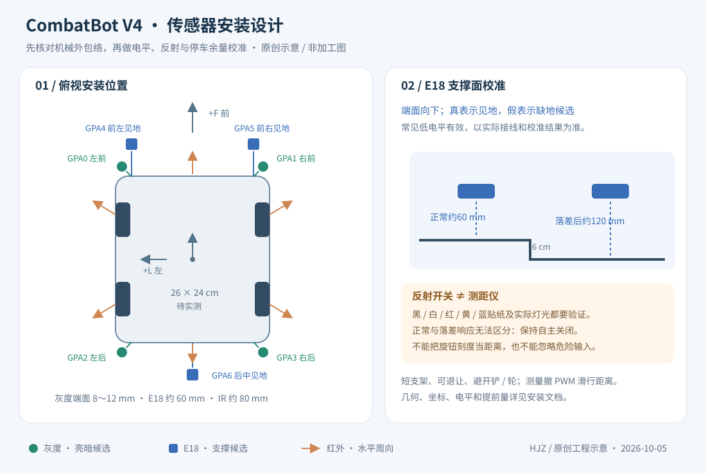

# V4 传感器安装与校准

本方案使用现有四路灰度、三路 E18、6/12 路 GP2Y0A02、四轮 FG 和惯性器件。首次装车时自主开关保持关闭；完成本文步骤后再在本地启用。**软件检查不能证明车已具备越过 6 cm 直阶或防掉台的机械能力。**

图为本项目原创设计示意。车体尺寸、探头高度和支架坐标是安装起点，不是原机械模型已核实的尺寸。

## 坐标与机械外包络

车体坐标：前方 F 为正、左侧 L 为正、上方 Z 为正；世界地图另用中心原点 X/Y，避免把车身左右与网页左右混为一谈。

默认 `arenaBodyLengthCm=26`、`arenaBodyWidthCm=24`。用实际轮胎、底盘、铲面与刚性附件的运动外包络重新测量，更新这两个参数。导航采用半对角线作为保守车身半径，默认约 17.7 cm，并另加 `arenaMarginCm=8` 和定位误差规模。

支架应圆角、可退让、固定走线并预留调整槽，避免碰撞时形成刚性长悬臂。前探头不得被铲面挡住，线束不得进入轮胎和舵机运动范围。若实际探头坐标不符合以下模型，先调整安装或更新实现，不只在网页改车身大小掩盖差异。

## 四路灰度：向下观察四角

MCP23017 GPA0～3 的顺序固定为左前、右前、左后、右后。灰度仅提供数字亮暗候选，不能识别红、黄、蓝颜色，也不能直接测出台面高度。

设车身半长 A、半宽 B，以下坐标均以 cm 表示：

| 通道 | 位置 | F / L 公式 | 26 × 24 cm 示例 |
|---|---|---|---|
| GPA0 | 左前 | A+1.5 / B−1 | +14.5 / +11 |
| GPA1 | 右前 | A+1.5 / −(B−1) | +14.5 / −11 |
| GPA2 | 左后 | −(A+1.5) / B−1 | −14.5 / +11 |
| GPA3 | 右后 | −(A+1.5) / −(B−1) | −14.5 / −11 |

探头端面先以距当前支撑面 8～12 mm 安装，保持垂直向下并可调高度、阈值和遮光。分别记录黑灰台面、白色边条、红色中心图案、黄色/蓝色启动区的输出，核对 `grayActiveHigh` 的实际电平。

**亮色不是全场统一危险。** 算法只在已知高台层面、估计探头接近台边时，把亮色作为辅助风险；中央图案和低层启动区不靠一个亮值判掉台。灰度标定不能替代向下支撑检测。

## 三路 E18：向下检查支撑面

GPA4～6 对应前左、前右、后中。安装后归一化状态 `true` 表示见地，`false` 表示缺少支撑候选。常见开关为低电平有效，默认 `e18ActiveHigh=false`；必须以实际器件、上拉、电压转换和网页读数核对。

| 通道 | 位置 | F / L 公式 | 26 × 24 cm 示例 |
|---|---|---|---|
| GPA4 | 前左 | A+5 / B−2.5 | +18 / +9.5 |
| GPA5 | 前右 | A+5 / −(B−2.5) | +18 / −9.5 |
| GPA6 | 后中 | −(A+5) / 0 | −18 / 0 |

端面垂直向下，正常支撑面距离先取约 60 mm。相同高度驶到 6 cm 落差外侧时，目标地面距探头约 120 mm。这是需要验证的两种条件，**E18 是可调反射开关，不是测距仪**；不能把旋钮刻度视作准确距离。

在真实灯光下逐一测试各色贴纸：正常地面持续见地，落差后的同色地面持续失地。检查遮光、倾斜、机身俯仰和铲面反光。若两类响应重叠，调整安装高度、角度或遮光；仍不能区分时保持自主关闭，不能通过忽略探头“修复”停车。

危险快路径使用原始归一候选，不等待完整去抖；解除与恢复需支撑稳定。前方缺地只允许后方安全的有界后撤，后方缺地只允许前方安全的有界前移；前后同时危险或必要 IO 失效会停止。正在登台时出现支撑危险，尝试终止并保留未知过渡层，不能为了冲台屏蔽防掉输入。

## 周向红外：水平向外

六路依次为前、右前、右后、后、左后、左前；十二路从前开始顺时针每 30° 一路。保留 V3 跳过电池 CH6 的模拟通道约定。建议端面离支撑面约 80 mm、水平向外，避开铲面、轮胎和相邻探头反光。

GP2Y0A02 的当前有效判据为约 20～150 cm。围栏高约 20 cm，但场地中心到围栏约 190 cm；红外不是覆盖全场的定位系统。80 mm 高度也通常看不到 60 mm 台阶侧面，不能用它证明登台或掉台。

用已知距离分段记录每路电压与网页读数，校核比例和近场盲区。超量程显示无效不是故障短路的豁免，也不代表道路安全。格斗中的目标是连续测距候选，不能保证物体就是对手；已知外墙的一致回波会被保守排除。

## FG、惯性与停车余量

先架车确认逻辑前进、输出极性、FG 增量和轮序，再做 IMU 静止零偏、直线行程及转向标定。单相 FG 的符号来自已施加方向，外力推动、空转和滑移仍会破坏地面位移估计。

惯性安装需 Z 轴朝上，并核对偏航轴与符号；登台采用倾角事件链，冲击或饱和期间不累计成功证据。瞬时动态加速度不是重力姿态的可靠替代。

初始自主速度为导航/搜索 12 cm/s、推撞 18 cm/s、登台尝试 20 cm/s。是否能够爬阶由轮胎、重心、铲面、扭矩和台边共同决定；失败不能靠自动加速或无限重试掩盖。

提前量须覆盖：`速度 × 实测采样响应时间 + 撤 PWM 后实测滑行距离 + 安装余量`。当前停车为撤输出，配置中的减速度约束不等于机械制动能力。架车、低速平地、带人工保护的边界与台阶试验应按此顺序进行。

## 启用清单

1. 核对 IO 电平、FG 方向与惯性轴；确认未连接/过期输入会阻止自主。
2. 测量机械外包络，更新车身、余量、速度与入口配置。
3. 在全部场地颜色/照明下验证三路 E18 的正常见地与 6 cm 落差失地。
4. 确认前后探头提前量、实际滑行与换向等待，降低速度直到余量足够。
5. 停车设置人工起点、航向与低层/高台层面；校验地图方向一致。
6. 在本地完成校准后启用 `arenaEnabled`、`arenaCalibrated`；确认机械爬台能力后再启用 `arenaClimbEnabled`。三个字段首启均为 `false`，标记校准不等于软件已测量或认证硬件。
7. 按顺序试低层导航、局部脱边、独立登台、跨层导航和自主格斗。每次失败先核对原因，重新锚定未知层面，再明确重新启动。

自主任务可在云端断网后继续到预算结束；本地急停和必要传感器判据始终有效。具体状态、恢复与估计边界见 [自主控制与定位](../design/V4自主控制与定位.md)。
