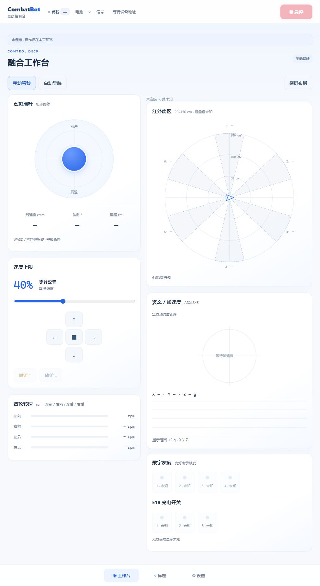
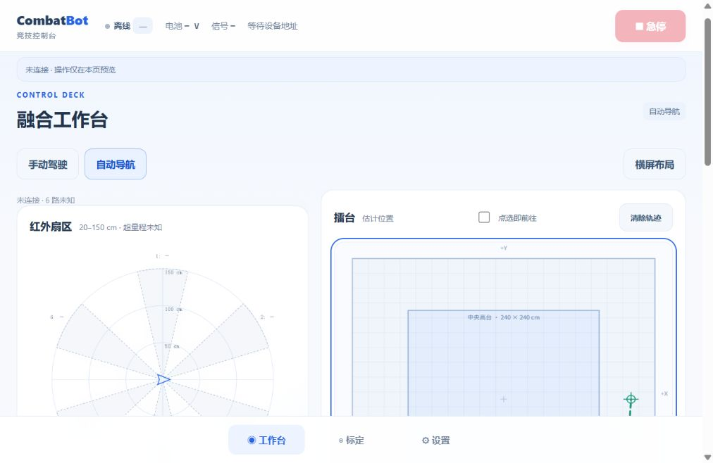

# V5.0 预备记录：融合工作台与实测调校

作者：HJZ · 记录日期：2026-10-06 · 状态：本地预备交付完成，软件验证通过，尚未公开发布

基线为 [V4.0 / 4697306](https://github.com/HJZ0810/Huabei-Wusheng-Gedou-Sai-ESP32-FangAn/tree/v4.0)。[V4.0 Release](https://github.com/HJZ0810/Huabei-Wusheng-Gedou-Sai-ESP32-FangAn/releases/tag/v4.0) 已发布。本页记录 V5 预备分支的实际源码和检查结果；完整门控、Arduino实际双编译及本地打包校验已完成；公开发布与公网升级尚未执行，验证凭据独立绑定V5。

## 相对 V4 的变化

| V4 使用方式 | V5 已实现 | 进步与使用边界 |
|---|---|---|
| 驾驶、竞技、传感器分开切页 | 主导航改为工作台、标定、设置；手动左摇杆右传感器，自动左传感器右地图 | 操作与观察共页；切换布局不会启动比赛或接管任务 |
| 布局主要按窗口宽度适配 | 显式横屏按钮，直接旋转操作容器，地图和摇杆共用逆变换 | 无须判断用户设备朝向；完整图形按旋转后的可用高度缩放 |
| 未连接时设置未填好默认值 | 全量固件默认参数先填写为本地草稿，保留 PID、四轮反向与兼容字段 | 可查看、编辑、导入、导出；不会冒充设备读取成功或自动写 NVS |
| 离线雷达缺少完整形态 | 640×640 大雷达、距离环及未知扇区；地图无遥测仍显示场地 | 开发预览可操作摇杆外观，离线不会发驾驶指令或生成模拟读数 |
| 显示目标与历史轨迹 | 当前导航阶段完整剩余航点；离线或候选目标可见本地绕台预览 | 实线来自新鲜车端遥测，虚线是本地预览；无定位不补造真实路线起点 |
| 地图选点后再执行 | 增加默认关闭的“点选即前往”开关 | 用户显式开启且在自动布局、有效连接与控制权下，点图才提交 goto |
| 缺失传感器会拒绝手动驱动 | 默认关闭的 developmentMode；受限人工开环驱动 | 最终 PWM≤180/1023、单次最长15秒；不承诺实际车速或缺传感器下的防跌落 |
| 行程、转向修正分散 | 标定中心、实测候选预览、左右转独立系数和结果绑定 | 结果 id、上电 sessionId、配置 configRevision 全部匹配，成功保存后回读确认 |

单车专属链接、AP/STA、排他控制权、急停旁路、换向保护和自主断网继续沿用 V4；这些继承能力不重复列为 V5 新增。设计细节见 [V5 工作台与调试设计](../design/V5融合工作台与调试设计.md)。

## 已实现的标定与观测

- **静止 IMU 零偏：** 继续使用车端静止采样流程，有效采样完成后由固件保存。
- **100cm 前进行程：** 设备记录四轮脉冲增量绝对值均值；尺量实际距离后预览 pulsesPerCm，应用时同步换算 ppr。普通直线复验可设置正负距离，但尚无独立的后退标定任务或方向行程系数。
- **左转/右转360°：** 两个独立请求分别修正 turnFactorLeft 和 turnFactorRight。以本次生效系数、目标角度与外部实测角度计算候选，IMU 到位误差不代替量角器外测。
- **登台观测：** 开始与结束观测均保持零 PWM，只记录轮程估计、持续时间、最大倾角、支撑变化；它不会自动冲台，不判断台阶真实高度，不认证登台成功，也不自动修改登台参数。实际是否登台需另行人工记录。
- **直线/定角复验：** 保留原精准动作作为标定后的复验工具；明确应用之前，候选计算不修改设备确认值。

新的应用接口严格绑定最近结果：id + sessionId + configRevision，核对类型、当前配置及未消费状态。网页也校验本页请求与连接；断线、参数改变、更新结果或迟到响应不能让旧记录继续授权保存。几何修正须成功写 NVS 后才消费结果，并重新读取设备配置。

## 开发调试的具体约束

developmentMode 默认 false，需连接本地车辆 Wi-Fi 明确保存后启用。只放宽人工摇杆的缺失 IMU、数字输入与无效测距门槛；开发人工驱动使用前馈开环并清空轮速 PID 积分，避免未接 FG 被当成持续速度误差。死区与左右补偿之后仍把最终请求限制在180/1023以内。

单次人工动作的绝对期限为15秒，持续发送 drv 不延长期限。超时后车端锁存拒绝所有Drive，网页也释放持续指针与按键。必须松手或点停止，让显式Stop执行后再由新的人工输入发起；零Drive、心跳、内部断线停车和Unlock不能解除锁存。停止、急停、驱动初始化失败、排他控制权、换向等待、心跳停车仍保留；有效且启用的危险探头继续参与保护。自动比赛、导航、精准运动、几何标定与观测各自保留必要反馈条件。缺失探头无法提供边缘或支撑信息，开发模式不提供完整防跌落能力。

页面显示“开发调试 · 低 PWM · 单次最长15s · 速度未知”。无 FG 时，显示的零轮速不能当作真实静止或精度证明。完成模块安装后关闭开发模式，再按现场条件校准并启用比赛。

## 路径与视觉语义

低层预览使用六节点可见图与 Dijkstra 绕开膨胀后的中央高台；高台目标仅在内缩范围内生成直线预览。没有车端定位时，预览以“设置起点”表单中的草稿坐标为起点，并明确标为虚线草稿预览，不绘制虚构车辆与历史轨迹。

车端输出的是当前导航阶段1～6个剩余航点；直达目标只剩1点时，网页从新鲜估计位置连到该点。跨层任务随导航、入口对正、登台和高台导航更新阶段与路线，不提前画一条保证执行的跨层轨迹。过期遥测、无效定位和无效路线不能展示为实时计划。

白蓝主界面保留短状态、轻阴影、面板入场和控件高亮；装饰效果不模拟障碍、定位或在线状态，并支持减少动画。横屏详情可在各列内部纵向滚动，雷达与地图优先完整呈现。

## 未新增的能力

当前没有新增自动直行偏差修正、独立后退几何系数、舵机机械限位自标定、多次试验历史库或登台参数自动建议；既有相关参数仍可在设置里明确编辑。公网继续只开放 V4 已有驾驶与自主协议，配置、标定、解锁、Wi-Fi及凭据管理仍通过本地车辆 Wi-Fi 完成。当前分支未部署到生产服务器。

## 验证与发布状态

| 检查 | 当前记录 |
|---|---|
| ui_contract.mjs | 已通过，含离线摇杆、横屏逆变换、候选预览、三字段绑定及观测 |
| ui_arena_contract.mjs | 已通过，含单点/多点路线、无定位/过期过滤、绕台预览、点选即前往门控 |
| ui_contract.mjs --file | 已通过，离线脚本初始化和本地二维码正常 |
| UI文件差异格式 | git diff --check 已通过 |
| 完整软件门控及主机固件回归汇总 | 19条记录全部通过，含控制、配置、采集、电机、网页、服务端及迁移 |
| Arduino-ESP32 2.0.17 / 3.3.12 实际双编译 | 实际分文件草图双编译链接通过，退出码均为0；core3使用3MB Huge APP |
| 实际浏览器最终视觉检查 | 390×844手机横屏和桌面复查通过；雷达/地图完整，离线预览与默认值正常，控制台无错误 |
| V5完整包、GitHub Release、公网升级 | 本地完整包已校验；GitHub Release与公网升级未执行，正式入口仍为V4.0 |
| 烧录、实车、6cm台阶与防掉验收 | 未进行；用户尚未完成装车 |

V1～V4完整展开记录、固定标签、原工程和发布入口继续保留。V5已生成自身源码与日志哈希凭据，后续源码改动或发布前须重新验证；软件通过也不能代替实际停止距离、反射电平、滑移、爬阶或防跌落验证。

## 本地交付与实际编译记录

验证时刻（UTC）：`2026-10-06T01:46:22.172140+00:00`。凭据绑定101项当前发布输入和19条成功检查记录；凭据SHA256：`892adce00619ed0fb4b12a7629f99bfd1441cd6498a0a629f307a01cdc38f224`。完整日志随包提供，不替代实车运行数据。

| 实际工具链/分区 | Flash | 静态RAM |
|---|---|---|
| Arduino-ESP32 2.0.17 / 3MB APP | 1,177,277 / 3,145,728 B | 62,940 / 327,680 B |
| Arduino-ESP32 3.3.12 / Huge APP | 1,399,132 / 3,145,728 B | 64,960 / 327,680 B |

core3 FQBN为`esp32:esp32:esp32s3:PartitionScheme=huge_app`，本轮8 jobs增量构建仍实际重新编译受影响模块并链接。需要至少3MB APP；不宣称默认1.25MB APP通过。静态RAM不含运行堆、任务栈或TLS峰值。

本地包名：`CombatBot_V5.0_Arduino完整工程.zip`，包含当前Arduino工程、网页源码、固定依赖、文档、19项检查日志与V1/V2/V3/V4完整历史快照。历史31/37/123/187个文件均与来源Git blob逐字节一致；旧标签及main不变，未重新编译旧版本。

最后联查修复了两项输出问题：开发超时后的持续drv不能重新开启窗口；Core3零PWM写失败关闭准入，尝试其余通道并保留上次被API接受的软件请求。Core2写接口没有返回值，不能检测运行期失败。输出请求/确认缓存不是物理PWM测量。另修正了core3的uint32_t/std::min模板类型兼容。

截图为离线状态：虚线从草稿起点规划，车辆和测量仍显示未知；不会发送导航。
