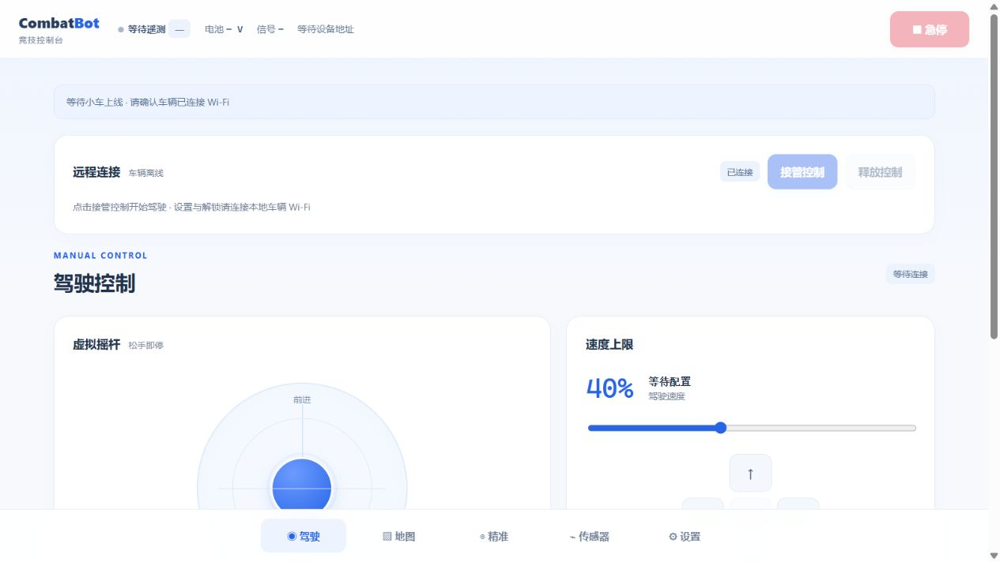

# V4 单车公网入口与部署记录

公网入口为 [combatbot.luo-jin-ai.com](https://combatbot.luo-jin-ai.com/)。网页采用白蓝配色，普通访问显示控制台；持有专用链接的浏览器建立控制会话，无需账户、输入口令或选择车辆。链接中的控制凭据位于 `#control=` 片段，网页消费后清除地址栏片段；服务器仅保存摘要。真实链接和车端密钥存放于仓库外受限文件，不进入 Git、发布包或本文。

## 服务布局

| 项目 | 配置 |
|---|---|
| 服务器 | server-manager 的 `server2`，154.201.67.63 |
| 域名 | 泛解析 A 记录已核验指向上述地址 |
| TLS | Let's Encrypt，域名专用证书，ISRG Root X1 信任链验证通过 |
| 有效期 | 2026-10-05 15:11:08 UTC 至 2027-01-03 15:11:07 UTC |
| 后端 | 独立 `combatbot.service`，Node 22.23.2，单进程 |
| 监听 | `127.0.0.1:8090`，公网由 Nginx HTTPS/WSS 反向代理 |
| 配置 | `/etc/combatbot/config.private.json`；目录0750、文件0640，root/combatbot |
| 当前部署 | `/opt/combatbot/releases/v4.0.0-final-20261006`，`current` 指向此目录 |
| 同次备份 | `/var/backups/combatbot/v4.0.0-final-20261006`，0700 |
| 证书续期 | `certbot.timer` 已启用，续期部署钩子先 `nginx -t` 后 reload |
| 公网限流 | `/api/connect` 按真实来源 IP 限速，服务另有连接/帧/租约限制 |

设备本地配置使用 `cloudHost=combatbot.luo-jin-ai.com`、443端口、`cloudPath=/ws/device`，填写独立设备密钥和完整可信CA。车端仅在STA连接可用且云开关启用时主动建立WSS，普通AP继续保留本地控制页面。

## 最终源码与运行核验

2026-10-06（北京时间）最终部署共18个白名单文件，逐文件SHA256与本机维护源码匹配。上传tar SHA256：

```text
72e89b25840f945c5cddec76efbaec87b27dc4d6df896f4ee4803d7fdd18d65a
```

`combatbot.service`状态active，`nginx -t`通过。部署目录与同次备份见上表；最终固件编译、全量凭据和GitHub附件属于单独交付检查，不能用部署tar替代完整Arduino发布包。

## 已执行公网检查

2026-10-06（北京时间）真实执行 `node --dns-result-order=ipv4first server/scripts/public-smoke.mjs`，使用受限本机凭据文件和离线设备协议替身，结果如下：

```text
PASS HTTPS certificate validation, exact page, info, anonymous and Origin boundaries
PASS private control link, Secure cookie, authenticated operator/device WSS, lease
PASS command/ACK/telemetry relay, duplicate sequence rejection, disconnect lease_end
PASS disconnect; protocol substitute complete, no physical vehicle tested
```

服务端在Linux真实运行14项HTTPS/HTTP/WSS集成测试（含父测试），全部通过。`npm ci --ignore-scripts --omit=dev` 使用锁定 `ws 8.22.0`，当次 audit 为0漏洞。部署的网页与本机维护源码逐字匹配，服务源码亦按SHA256核对。最终构建与归档证据见 [验收与验证](../../验收与验证.md)。

原网站 `/`、`/api/status`、`/dashboard/overview`、`/docs/` 分别保持200；原 `/desktop/` 保持404。原 `/etc/nginx/conf.d/kc.top.conf` 已恢复部署前的完整字节，SHA256为 `65f5bb30b7f4c851460e51ce9504401bba4c93640d86f662724cc332191a2dad`；新入口使用独立 `combatbot-domain.conf`，其他业务服务未重启。

公网替身检查证明服务与协议链路工作，不代表ESP32实际TLS握手、无线实时性、运行堆峰值、机械登台或防跌落已通过实车验收。设备暂未安装，页面不会伪造车辆位置或在线数据。

## 真实浏览器检查

普通入口首先显示未授权；在同一页面打开专属 `#control=` 链接后，页面建立控制会话并清空hash，状态显示“已连接 / 车辆离线”。本次未点击接管或发送任何运动。截图是最终公网真实页面，设备尚未安装，车辆数据未伪造。



## 首次部署与更新

1. 所有SSH上传、下载和命令执行均通过规定的 `D:\PRO\claw\linshi\server-manager\server.ps1`，明确指定 `-Server server2`；不将凭据放进命令参数或操作日志。
2. 在仓库外受限目录运行 `server/scripts/create-config.mjs`，生成单车登记配置以及独立 `.device-key`、`.control-key`。更新网页或程序时复用当前配置；只有需要撤销旧入口时才更换对应密钥。
3. 仅打包服务端白名单源码、锁文件、部署文件及 `combatbot/web/index.html`。不上传本机工具、node_modules、测试私钥或原始网页控制密钥。
4. 新域名先配置HTTP-01验证入口，通过既有Certbot账户签发专用证书。`server/deploy/combatbot-domain.conf` 依赖该证书，不能在证书缺失时直接启用。
5. 上传到受限暂存目录，通过 `server/deploy/deploy-server2.sh` 部署唯一发布编号。脚本先执行服务端测试，备份既有单车配置、服务文件、Nginx文件与旧发布路径，随后原子切换 `current`。失败恢复原单车配置并保留备份，不修改其他站点。
6. 检查service active/enabled、回环监听、HTTPS证书、源码哈希和公网smoke；设备在线时禁止协议替身覆盖真实连接。网页与设备真实联调另按 [装机验收](../../验收与验证.md) 执行。

## 回退

每次部署的备份保存在 `/var/backups/combatbot/<发布编号>/`，目录0700。需要回退时，先停止 `combatbot.service`，根据备份的 `previous-release` 恢复 `current`，恢复同次登记配置、`relay.env`、systemd与独立Nginx配置，执行 `systemctl daemon-reload`、`nginx -t`，再启动单车服务并reload Nginx，最后重跑公网检查。不要拿旧账户版的登记配置启动当前免账户服务；配置结构不匹配会明确拒绝启动。

保留历史发布目录与备份即可恢复源码和配置；内存会话/租约不会恢复，浏览器需重新打开专用链接并主动接管。已在车端运行的自主任务仍按车端预算和保护判断，不由重启服务器自动重新发送。
