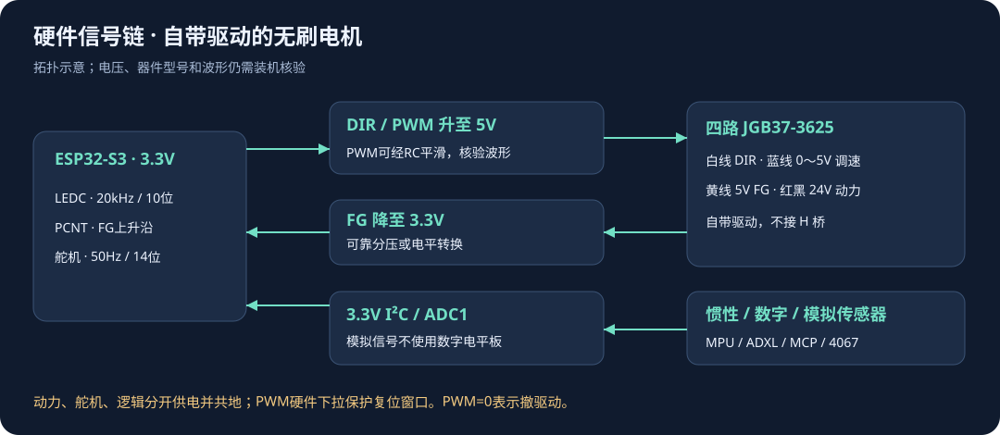

# 新手安装与接线

示意图说明安装顺序与信号关系，不是当前电脑截图。


## 1. 打开草图

解压完整包，打开 CombatBotArduino/CombatBotArduino.ino。同目录cpp/h一起编译，不要只取一个ino；完整包已按Arduino同名目录规则组织。

## 2. 安装开发板

Arduino IDE 2.x“文件→首选项→附加开发板管理器网址”追加：

```text
https://espressif.github.io/arduino-esp32/package_esp32_index.json
```

保留已有网址。开发板管理器搜索esp32，确认作者Espressif Systems，安装3.3.12。选择ESP32S3 Dev Module。N16R8选16MB Flash、OPI PSRAM、QIO、16M Flash(3MB APP/9.9MB FATFS)、USB CDC Enabled、240MHz。其他模组按实际容量设置，不猜型号。

未接设备也能验证，串口只影响上传。本次不执行上传。

## 3. 安装三个库

| 库 | 版本 | 作者/分支 |
|---|---|---|
| ArduinoJson | 7.3.1 | Benoit Blanchon |
| AsyncTCP | 3.3.2 | ESP32Async |
| ESPAsyncWebServer | 3.6.0 | ESP32Async |

用“项目→加载库→添加.ZIP库”安装随包Arduino依赖库中的三个ZIP。Wire/WiFi/ESPmDNS/DNSServer/Preferences/PCNT来自板包，无需Adafruit库。融合固件使用自己的寄存器驱动。

“找到多个库”时核对日志实际选中路径和版本，同名不代表同分支。手动安装脚本先备份旧库，不改板包，不上传；融合工作未执行它。

## 4. 验证与报错排查

| 现象 | 处理 |
|---|---|
| 找不到库头文件 | 核对草图本libraries位置、三个指定ZIP |
| LEDC API找不到 | 核对ESP32-S3和core2.0.17/3.3.12，源码已分两代API |
| Async方法不匹配 | 核对ESP32Async作者及版本，不混旧头文件和新源码 |
| APP分区不足 | N16R8按推荐3MB APP；默认板配置另有软件验证，见验收文档 |
| 首次编译很久 | 查看编译日志是否推进，首次板包编译较慢 |
| 页面打不开 | 上板后先连AP访问192.168.4.1，再排查mDNS/STA |

## 5. 接线口径



| 功能 | GPIO |
|---|---|
| 4067 SIG（ADC1） | 4 |
| 4067 S0/S1/S2/S3 | 5/6/7/8 |
| I²C SDA/SCL | 9/10 |
| 舵机50Hz PWM | 11 |
| LF DIR/PWM/FG | 12/13/14 |
| RF DIR/PWM/FG | 15/16/17 |
| LR DIR/PWM/FG | 18/21/38 |
| RR DIR/PWM/FG | 39/40/41 |

MPU6050地址0x68、ADXL345 0x53、MCP23017 0x20，I²C为3.3V。MCP GPA0～3接灰度、GPA4～6接E18，核对上拉电压和有效电平。4067默认CH0～5为IR、CH6电池分压，12路IR按CH0～5/CH7～12避开CH6。

IR从正前顺时针安装，6路前/右前/右后/后/左后/左前。20～150cm以外、近端非单调区和断线不能仅靠无效标志区分。启用严格策略前先验证可用性。

JGB37-3625自带驱动，白DIR、蓝0～5V调速、黄5V FG、红黑24V动力，不接H桥。DIR/PWM可靠升到5V，FG可靠降到3.3V。20kHz PWM可按原方案RC平滑，但需实测波形；普通I²C电平板不保证PWM质量。

动力、舵机和逻辑分开供电并共地，舵机不从主控3.3V供电。电池100k/10k分压默认倍率11。模拟输入不得用数字电平板。PWM硬件下拉保护复位窗口；GPIO19/20保留USB，26～37保留Flash/PSRAM。

## 6. 装机顺序

后续先降速抬轮核对极性和FG，再核对陀螺方向、IR位置和数字有效电平；按IMU→行程→转向标定。急停后所有标定仍受锁定约束。

安全总开关默认关闭仅供首次调试。启用保护前确认通道有效，当前撤PWM不保证机械停稳。实车精度、NVS断电、停车时间和网络抗干扰另行测量，见验收清单。
